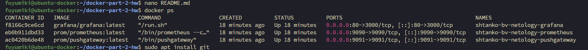
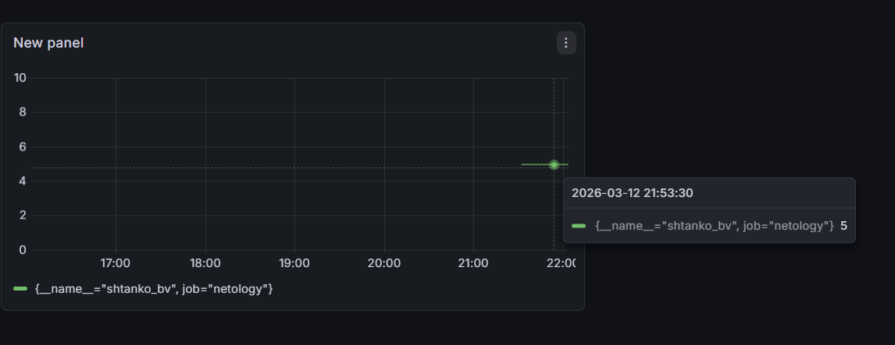
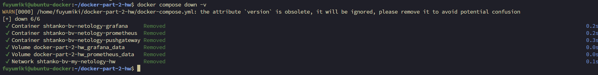

Задание 1

Docker Compose - это инструмент для запуска и управления многоконтейнерными приложениями Docker. С его помощью можно описать все сервисы, сети и тома в одном YAML-файле и запускать их одной командой. Это значительно упрощает работу, так как не нужно вручную запускать каждый контейнер. Лично для меня Docker Compose полезен тем, что позволяет быстро развернуть стек сервисов (например Prometheus, Pushgateway и Grafana) и управлять ими через один конфигурационный файл.

Задание 2

Создан файл docker-compose.yml с базовой структурой:

version

services

volumes

networks

Используется подсеть:

10.5.0.0/16

Имя сети:

shtanko-bv-my-netology-hw

Все сервисы работают в этой сети.

Задание 3

Добавлен сервис Prometheus

Контейнер:

shtanko-bv-netology-prometheus

Порт:

9090

Добавлены тома:

данные Prometheus

конфигурационный файл.

Задание 4

Добавлен сервис Pushgateway

Контейнер:

shtanko-bv-netology-pushgateway

Порт:

9091

Используется для отправки пользовательских метрик в Prometheus.

Задание 5

Добавлен сервис Grafana

Контейнер:

shtanko-bv-netology-grafana

Порт:

80 → 3000

Создан файл конфигурации:

grafana/grafana.ini

Параметры входа:

login: shtankobv
password: netology

Задание 6

Настроены:

очередность запуска контейнеров (depends_on)

режим перезапуска (restart: unless-stopped)

единая сеть для всех сервисов

Запуск сервисов выполнялся командой:

docker compose up -d

Задание 7

Отправка пользовательской метрики в Pushgateway:

echo "shtanko_bv 5" | curl --data-binary @- http://localhost:9091/metrics/job/netology

Создан Data Source Prometheus в Grafana:

http://prometheus:9090

Создан Dashboard с графиком метрики:

shtanko_bv

# Скриншоты

## Работающие контейнеры

## Grafana Dashboard

Задание 8

Остановка контейнеров выполнена командой:

docker compose down

## Остановка контейнеров

